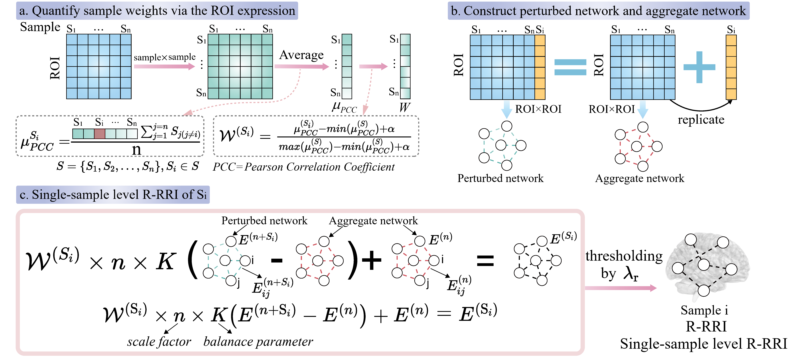

## Construction_of_single-sample_level_pattern

**Figure 1.** Illustration of single-sample level pattern construction.  
(a) Quantification of sample weights to obtain the expression matrix sample weight $W^{(S_i)}$ for each sample $S_i$.  
(b) Construction of the aggregate network and the perturbed network based on expression matrices. The aggregate network is established by calculating the PCC between the expression levels of any two features. A copy of each sample $S_i$ is added to the overall samples to calculate the PCC of every feature pair and build a perturbed network.  
(c) The single-sample network edge $E^{(S_i)}$ for each sample $S_i$ is inferred by evaluating the difference between the aggregate and perturbed networks, integrated with the corresponding sample weights, and then thresholded using $\lambda_\mathrm{r}$.

In this study, we adopted the SWEET method[1] to build individualized single-sample networks, as illustrated in Figure 1, for each subject **$S_i$**, utilizing the feature (e.g., imaging) expression profiles derived from a cohort of **$n$** case samples. To address the issue of biased edge numbers introduced by inherent subpopulation structures, SWEET first computes the Pearson correlation coefficient (PCC) between every pair of samples based on their expression profiles across **$m$** features. This results in a sample-to-sample PCC matrix (Figure 1(a)).

For each sample **$S_i$**, the average PCC value, denoted as **$\mu_{\text{PCC}}^{(S_i)}$**, is calculated and subsequently used to derive a sample-specific weight **$W^{(S_i)}$** that reflects its similarity to the overall cohort. The sample weight is formulated as:

  

where **$\mu_{\text{PCC}}^{(S_i)}$** represents the average PCC between sample **$S_i$** and all other **$n-1$** samples, **$\mu_{\text{PCC}}^{(S)}$** is the collection of mean PCCs from all samples in the cohort, and **$\alpha$** is a small constant (e.g., 0.01) added to the denominator to avoid division by zero.

Next, the PCC between features **$i$** and **$j$**, denoted as **$E_{ij}^{(n)}$**, is calculated across all **$n$** samples to form the aggregate network structure (Figure 1(b) and (c)). To derive a perturbed version of the network for a specific sample **$S_i$**, its expression profile is duplicated and added to the original sample group, after which the PCC is recomputed over the **$n + 1$** samples. The resulting perturbed edge is denoted as **$E_{ij}^{(n+S_i)}$**.

To personalize the network for each sample, we incorporate the sample-specific weight **$W^{(S_i)}$** to adjust for subpopulation effects. The final edge score for the single-sample network of **$S_i$**, denoted by **$E_{ij}^{(S_i)}$**, is computed as:

  

where **$n$** represents the total number of case samples used to scale the correlation difference, and **$K$** is a predefined balance coefficient (empirically set to 10% of the total sample size) to control the contribution of the sample-specific perturbation.

According to the systematic evaluation reported in[1], setting the balance parameter **$K$** to 10% resulted in optimal median values for both the average degree exponent **$\gamma$** and the coefficient of determination **$R^2$**. A higher sample weight **$W^{(S_i)}$** implies that sample **$S_i$** shares stronger similarity with the remaining cohort members, indicating potential membership in a larger subpopulation. Conversely, a lower weight may reflect distinctiveness, suggesting that the sample might belong to a rarer sub-cohort. This weighting strategy is designed to mitigate the influence of sample-level heterogeneity on differential correlation estimation.

To determine the statistical significance of each edge **$E_{ij}^{(S_i)}$**, we conduct a z-score–based test:

  

where **$\mu$** and **$\sigma$** denote the overall mean and standard deviation of edge values computed across all single-sample networks. An edge is considered statistically significant in the context of sample **$S_i$** if its absolute z-score surpasses a critical threshold (e.g., 1.960 or 2.576, corresponding to **$P \leq 0.05$** or **$0.01$**).

Finally, in our framework, we obtain a collection of sample-specific edge matrices, denoted as **$\mathcal{E}^m = \{ \mathbf{E}_i^m \}_{i=1}^{n}$**, by applying a sparsity-inducing threshold to each correlation-based network. This is achieved using a modality-dependent parameter **$\lambda_r^m$**, which facilitates interpretability while maintaining biologically relevant connections.

---

### References

[1] H.-H. Chen et al., “Sweet: a single-sample network inference method for deciphering individual features in disease,” Briefings in Bioinformatics, vol. 24, no. 2, p. bbad032, 2023.

